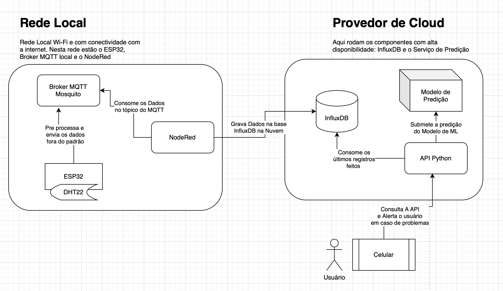
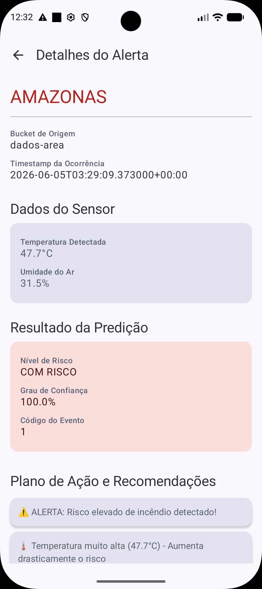

# FIAP - Faculdade de Informática e Administração Paulista

<p align="center">
<a href= "https://www.fiap.com.br/"></a>
</p>

<br>

# 🎓 Graduação ON em Inteligência Artificial  
## 📚 Repositório Oficial de Projetos e Trabalhos Acadêmicos

---

## 👩🏻‍💻 Sobre este Repositório

Este repositório term como objetivo documentar nossa Prova de Conceito (PoC) aplicando **os principais conceitos aprendidos na fase 3 e 4** do segundo ano de graduação de Inteligencia Artificial na FIAP 

Aqui você vai encontrar todos os detalhes, esplicações, diagrams, código e documentação do nosso projeto:

- Introdução com o propósito da nossa Prova de Conceito
- Arquitetura da solução
- Código gerado nos diferentes componentes (ESP32, APIs em Python, Interfaces em Reactive, etec)
- Video da apreserntação do projeto

Este repositório funciona como um **portfólio técnico estruturado**, evidenciando domínio progressivo das competências exigidas na formação.

---

## 1 Objetivo

Nossa prova de conceito consiste em monitorar regiões remotas com coleta de dados locais, integrada a um serviço em núvem que recebe violações de thresholds comuns nestas coletas e combina com análise de um modelo de Machine Learning treinado com dados da região para identificar possíveis riscos. Uma aplicação móvel vai alertas os responsáveis em tempo real sobre riscos que necessitam de alguma intervenção.

## 2 Arquitetura

### 2.1 Diagrama geral da solução



### 2.2 Coleta e pre-processamento (IoT e FogComputing)

Vamos usar um dispositivo IoT conectado a internet via Wi-fi com sensores de umidade e temperatura para identificar desvio nos thresholds padrões para o ambiente monitorado. Uma vez que esses thresholds sejam violados os dados da coleta serão enviados para um tópico em um broker MQTT. 
Uma instancia local no NodeRed coleta os dados do broker MQTT e envia para uma base de dados InfluxDB em um provedor de Cloud (vamos simular com uma instancia de container rodando o influxDB)


### 2.3 Analise de desvios (Cloud Comnputing e Machine Learning)

O Serviço hospedado em cloud conectado a esta base InfluxDB le cada registro que é armazenado nela para analisar os dados sobre possíveis desvios na telemetria (umidade e temperatura) do ambiente monitorado. 

Este Serviço possui um modelo de machine learning treinado para avaliar riscos climáticos na região. O modelo foi treinado de forma supervisionada (dados etiquetados) com informações da região sobre os últimos anos. 

Este Serviço possui uma API que analisa a última coleta enviada, e retorna a análise de risco .

### 2.4 Aplicação Móvel (Desenvolvimento Mobile em Android)

Aqui os responsáveis pela área monitorada usam um apliativo em seu telefone celular onde é recebem os avisos via notificação PUSH dos alertas de riscos confirmados por dados e um modelo de Machine Learning. Com essa informação em tempo real eles conseguem reagir de forma mais tempestiva para conter o problema.

O aplicativo consulta a API do serviço de análise e quando identifica algum risco avisa o usuário com os detalhes da análise. 



---

## 🧠 Estrutura Macro do Repositório

```bash
📂 FIAP-GRAD-ON-IA
│
├── 📂 implementacao
│   ├── 📂 2.1 - Requisitos
│   │   ├── 📂 imagens
│   │   ├── README.md
│   ├── 📂 2.2 - Esp32 - NodeRed
│   │   ├── 📂 imagens
│   │   ├── 📂 src
│   │   ├── README.md
│   ├── 📂 2.3 - Machine Learning - Predicao
│   │   ├── 📂 imagens
│   │   ├── 📂 src
│   │   ├── README.md
│   ├── 📂 2.4 - Aplicacao Movel
│   │   ├── 📂 imagens
│   │   ├── 📂 src
│   │   ├── README.md
└── README.md
```

---

## 📋 Licença

<p xmlns:cc="http://creativecommons.org/ns#" xmlns:dct="http://purl.org/dc/terms/"><a property="dct:title" rel="cc:attributionURL" href="https://github.com/SabrinaOtoni/TEMPLATE-FIAP-GRAD-ON-IA">MODELO GIT FIAP</a> por <a rel="cc:attributionURL dct:creator" property="cc:attributionName" href="https://fiap.com.br">FIAP</a> está licenciado sobre <a href="http://creativecommons.org/licenses/by/4.0/?ref=chooser-v1" target="_blank" rel="license noopener noreferrer" style="display:inline-block;">Attribution 4.0 International</a>.</p>
