# 2.1 Requisitos

## 2.1.1 Introdução
Para esta solução funcionar vamos ter que fazer algumas configurações para preparar o ambiente.

Primeiro você vai precisar dos seguintes pré-requisitos no seu ambiente:
- Notebook / Desktop conectado a internet
- Docker ou Podman instalados para execução de containers
- pelo menos 16Gb de memória RAM para executar todos os componentes

## 2.1.2 Montando o ambiente

### Carregando a infraestrutura

Para funcioanr vamos precisar subir alguns compoentes. 
Execute o comando abaixo na raiz do projeto:

```
docker-compose up
```

Esse comando vai subir alguns componentes:
- Grafana
- Broker MQTT Mosquito
- NodeRed
- InfluxDB

### Configurando o ambiente

#### InfluxDB

Uma vez que a infraestrutura do nosso projeto esta em execução vamos acessar a console do InfluxDB para fazer a configuração inicial.

a) acesse a URL http://localhost:8086 para o primeiro setup. Informe os valores a seguir:
- username: fiap
- password: fiap@1234
- initial organization name: fiap
- initial bucket name: dados-area

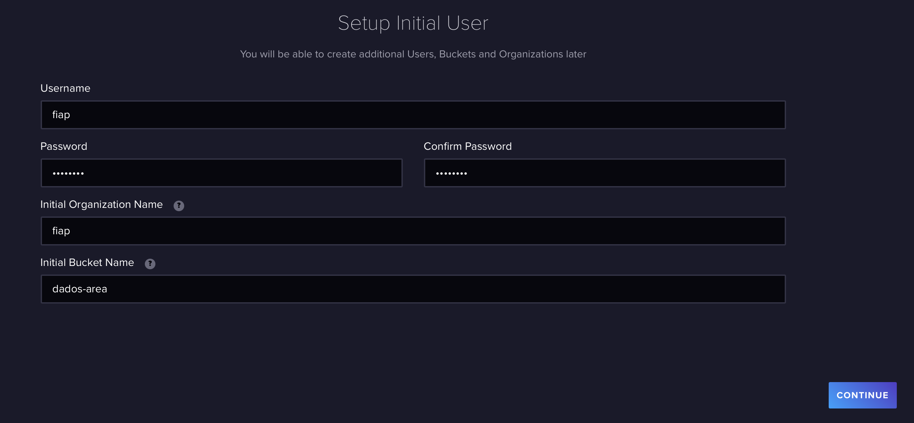

b) Nesta tela será gerado um token para as integrações futuras. Armazene esse valor em lugar seguro para uso posterior. 
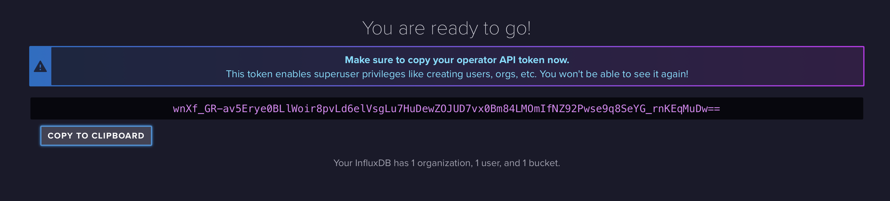

#### NodeRed

Algumas ações são necessárias no Node-REd:

##### Configurando o recebimento do MQTT
Para receber os dados dos sensores do ESP32 vamos precisar se conectar ao broker e ao tópico correto

a) Acesse a URL do node-RED pela url http://localhost:1880

b) Arraste um nó chmado "mqtt-in" para a área em branco do seu diagrama. Clique duas vezes nele, na tela que abrir use o botão "+" para adicionar um novo servidor
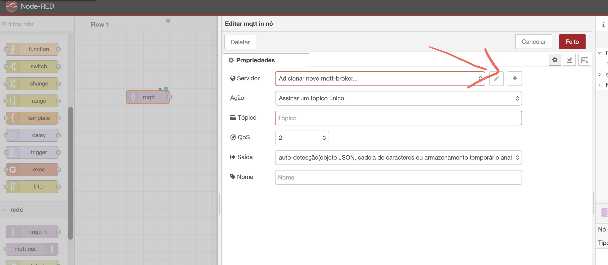

c) Faça isso com os dados abaixo:
- server: IP local do seu computador
- portal: 1883
- Client ID: node-rest-test
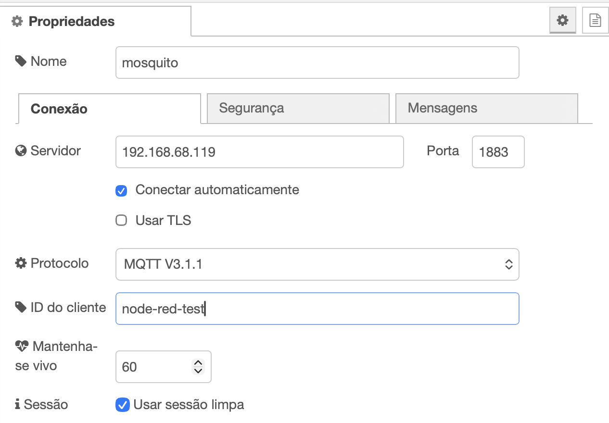

d) Nas configurações o Mqtt-in, agora deve aparecer seu servidor configurado selecionado. Configure os demais campos conforme segue:
- Action: Subscribe to a single Topic
- topic: dados-area
- QoS: 2
- Output: a parsed JSON Objetc
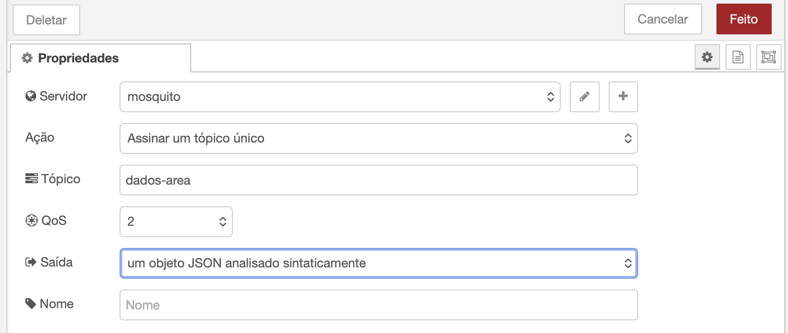

e) confirme a configuração clicando no botão "Done"

##### - Formatando a mensagem
Para que os dados que estamos coletando possam ser armazedos corretamente precisamos formata-los. 

a) adicione um nó chamado "Function" na área do seu diagrama

b) Conecte a saída do nó mqtt ao seu nó "function"

c) Clique duas vezes nele para editar. Cole o código abaixo dentro dele e salve com o botão "Done"
```
msg.payload = {
    temperatura: msg.payload.temperatura,
    umidade: msg.payload.umidade
};

// Tags ajudam a filtrar os dados depois no Grafana
msg.tags = {
    area_id: "amazona_01",
    setor: "TESTE_01"
};

return msg;
```
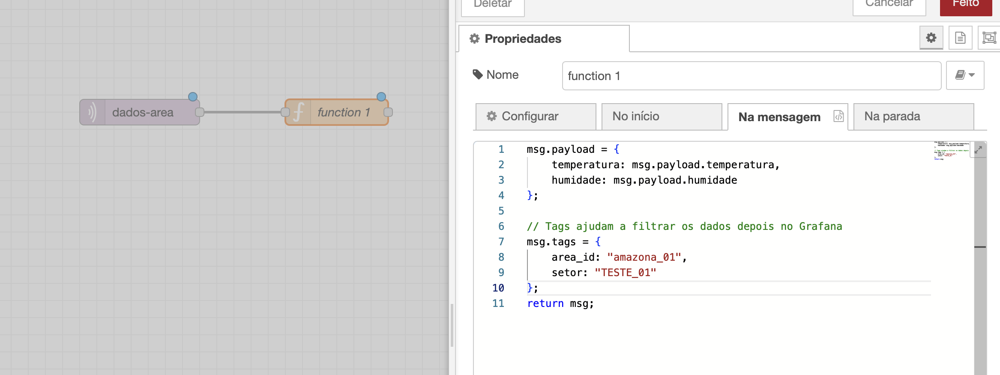


#### - Adicionando no node do InfluxDB:
Por padrão a instalação padrão do Node-RED não possui suporte ao influxdb, mas é fácil adicionar esta capacidade, pela própria interface do node-RED.

a) Acesse o menu no topo direito e escolha a opção "Manage palette"
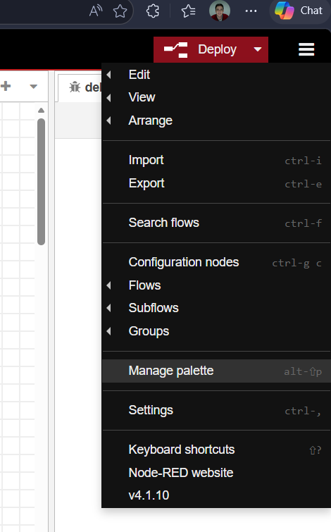

b) No menu vertical na lateral esquerda, selecione "Palette" se já não estiver selecionado

c) nas habas horizontais selecione a opçao "Install"

d) pesquise por "influxdb" e instale com o botão "install" ao lado do item, deve ser o primeiro da lista (node-red-contrib-influxdb)
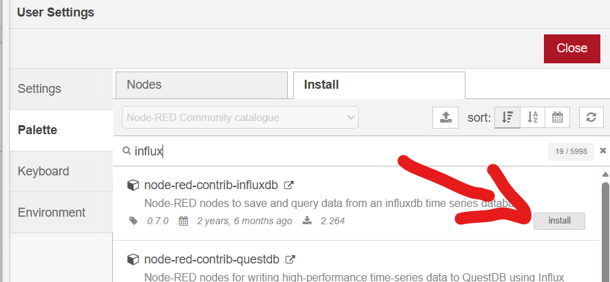

e) Agora procure na sessão "Storage" o nó "influxdb out" e adicione ao seu diagrama

f) Conecte a saída do nó function ao nó influxdb out que você acabou de adicionar

g) Clique duas vezes no nó do Influxdb para configura-lo. Cllique no botão "+" para adicionar um novo servidor de InfluxDB


h) Preencha os dados do servidor como descrito abaixo e confirme no botão "add":
- name: influxdb
- version: 2.0
- UTL: http://influxdb:8086
- Token: aquele que você salvou na etapa 3
- Connection timeout: 10 segundos
- Verify server certificate: desmarcado
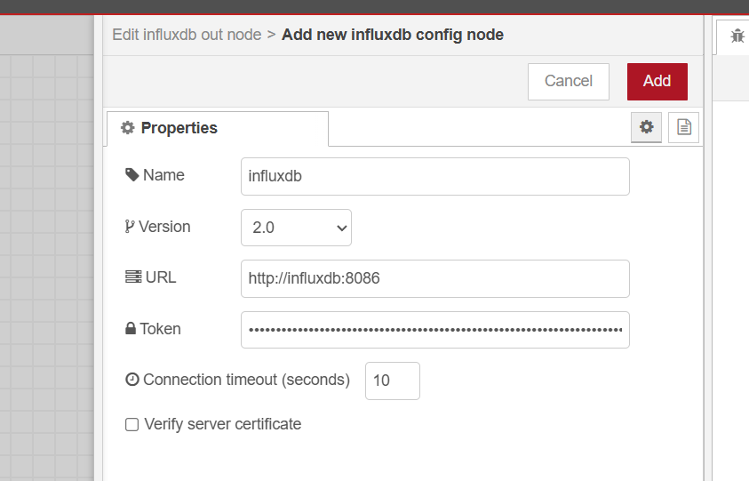

i) Na tela de configuração principal do nó. Garanta que seu servidor esta selecionado e ajuste os demais campos como segue:
- Name: influxdb
- Server: [v2.0] INfluxdb
- Organization: fiap
- Bucket: dados-area
- Measurements: amazonas
- Time Precision: Milliseconds (ms)
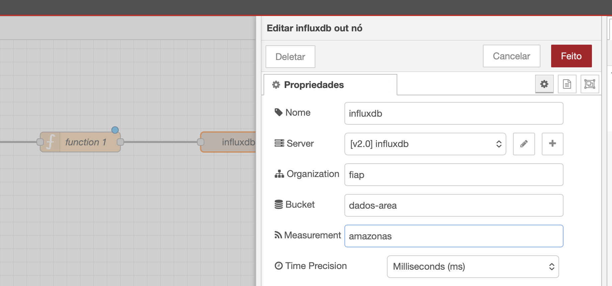

#### Instalar o Gateway para o WOKWI
Baixa o arquivo apropriado para a sua plataforma / Sistema operacional no site: https://github.com/wokwi/wokwigw/releases

Descompacte o arquivo e execute ele, você deve ter um resultado como a da imagem a seguir:
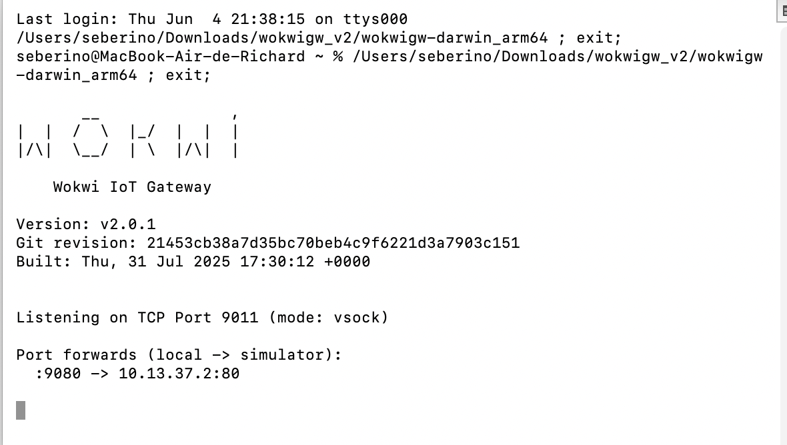

#### Abrir o projeto WOKI do ESP32 e configurar

Tudo comça com a coleta de dados na origem, com nosso ESP32. 
a) Acesse o projeto na URL: https://wokwi.com/projects/465942637127754753

b) Ative o Gateway no WOKWI, apertando F1 e selecionando "Enable Private WOKWI IoT Gateway"
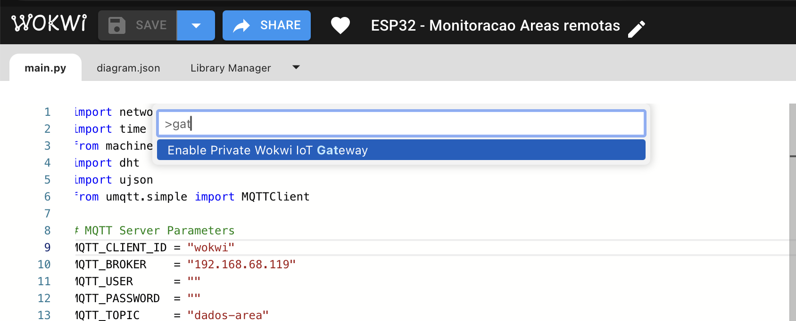

c) Edite o arquivo main.py na linha 10, substituindo o valor pelo IP do seu computador na sua rede. Não informe a porta, apenas o IP. 
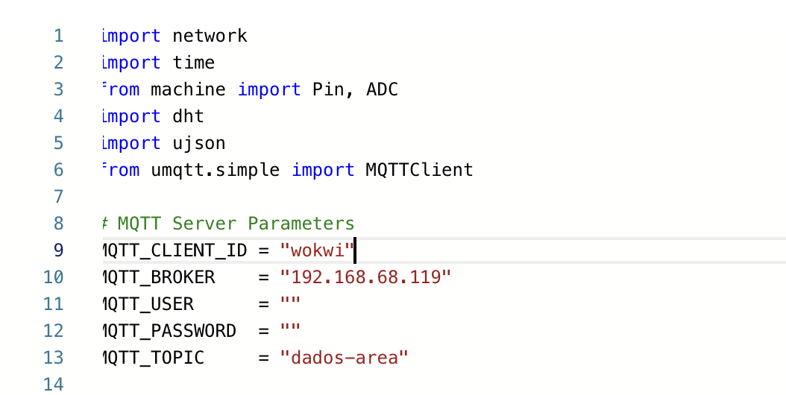


