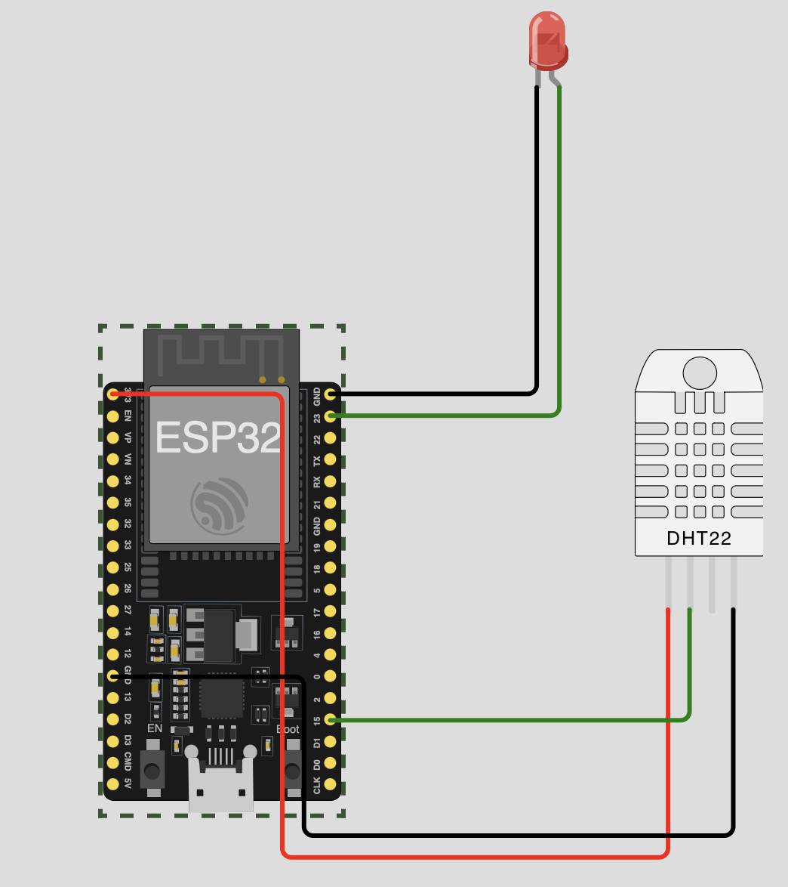

# Etapa 2.2 Coleta local e integração com Broker

## 1 Introdução

Neste módulo vamos documentar o desenvolvimento do módulo ESP32 que coleta os daos de humidade e temperatura em uma região remota, faz uma análise local (Fog computing) e caso identifique alguma anomalia baseado em padrões estáticos, envia os dados para um broker MQTT para uma análise mais profunda. 

## 2 Implementação

A implementação desta parte é dividida em 2 etapas:
a) Código Esp32 que coleta os dados e envia para um Broker MQTT
b) Broker MQTT que recebe os dados e deixa eles disponíveis para consulta

### 2.1 Dispositivo IoT

O projeto no ESP32 é bem simples, ele possui um Led (para indicar quando tem problema) e um sensor DHT22 para coletar dados de humidade e temperatura. 

 

#### Código ESP32

O inicio do códgio é imples, a importação de algumas bibliotecas:
- acesso a rede (para se conectar ao Wi-FI)
- sensor DHT22 (para interagir com o sensor e capturar os dados)
- JSON (para manipular o formato da mensagem que vamos enviar)
- broker MQTT (para se conectar ao broker e enviar mensagens)

```
import network
import time
from machine import Pin, ADC
import dht
import ujson
from umqtt.simple import MQTTClient
```

Depois fazemos o setup inicial com dados do IP do broker MQTT, credenciais, etc.
Além disso vamos definir as portas físicas onde o sensor e o LEd estão conectados

```
# MQTT Server Parameters
MQTT_CLIENT_ID = "wokwi"
MQTT_BROKER    = "192.168.68.101"
MQTT_USER      = ""
MQTT_PASSWORD  = ""
MQTT_TOPIC     = "dados-area"

sensor = dht.DHT22(Pin(15))
led_vermelho = Pin(23, Pin.OUT)
```

O próximo passo é definir um método que faz um processamento local dos dados coletados para aferir se é uma situação de risco que precisa ser reportada. 

```
def verifica_sinais(humidade, temperatura):

  # Definição dos critérios de normalidade
  # Lembrando que estamos simulando uma área de mata na Amazonia (que a temperatura varia de 22 a 33 graus dependendo do horário do dia)
  # e 75% (nas horas mais quentes) a 100% de humidade
  humidade_fora = humidade < 70 
  temperatura_fora = temperatura < 20 or temperatura > 38 # Verifica se esta muito frio ou muito quente

  # Se qualquer um dos critérios for "fora", retorna False indicando que os dados devem ser enviados para uma analise mais profunda com imagens
  if humidade_fora or temperatura_fora:
    return False
    
  # Dados normais
  return True  

```

A Seguir no código vamos se conectar a rede Wi-fi e depois ao servidor Broker MQTT
```
print("Conectando na rede WiFi", end="")
sta_if = network.WLAN(network.STA_IF)
sta_if.active(True)
sta_if.connect('Wokwi-GUEST', '')
while not sta_if.isconnected():
  print(".", end="")
  time.sleep(0.1)
print("\nConectado! IP do ESP32:", sta_if.ifconfig()[0])

print("Conectando no Servidor MQTT local (mosquito)... ", end="")
client = MQTTClient(MQTT_CLIENT_ID, MQTT_BROKER)
client.connect()

print("Conectado ao Broker MQTT!")
```

#### Integração com o Broker MQTT (Node Red)

Esta integração será feita com o Node Red.

A configuração passo a passo e a explicação do funcionamento deste componente esta documentado no item 2.1 - [Requisitos](../2.1%20-%20Requisitos/READM.md)

