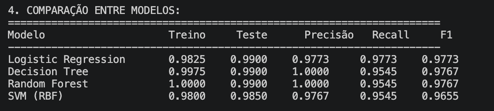
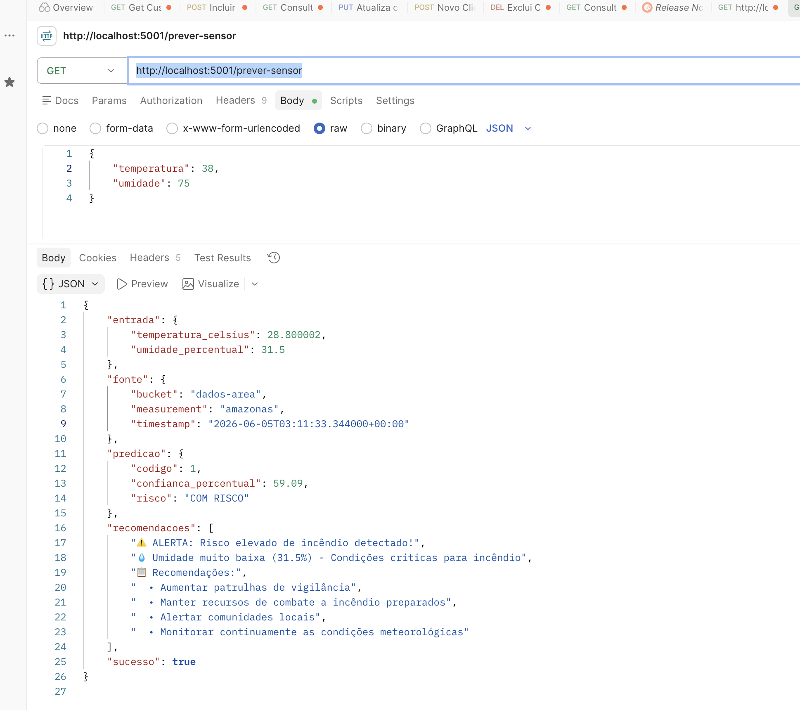

# 2.3 - Machine Learn

## 2.3.1 Introdução

Nesta fase vamos falar do serviço que valida usando um modelo de Machine Learn os dados coletados que violaram os thresholds. 

O serviço consulta os dados no InfluxDB e passa estes dados como parâmetro para o modelo para validar se existe de fato um risco. 

## 2.3.2 Treinamento o modelo

Criamos um código em Python que gera a massa de dados para treino e teste considerando o cenário da amazonia no que diz respeito a temperatura e humidade. 

Para gerar novamente os arquivos (JSON e CSV) execute o comando a seguir:
```
python3 gerar_dados_incendio.py
```

Agora para treinar o modelo desenvolvemos um códgio Python que executa as seguintes tarefas:
- normaliza os dados, 
- testa alguns algoritimos (Arvore de Decisão, Regressão Logistica, Support Vector Machine e Arvore Randomica)
- Analise os indicadores de performance (acuracia, precisão, Recall, R1-Score e ROC-AUC)
- Escolhe o melhor modelo para o nosso caso de uso

Para executar a avaliação e treino do modelo execute o código a seguir:
```
python3 treinar_modelo_incendio.py
```
O resultado desse código deve exibir todos os passos feitos para definir o melhor modelo (que no nosso caso foi o Regressão Logistica com o F1-Score de mais de 97%)



Para executar a API execute o comando abaixo:
```
python3 api_predicao_incendio.py
```


## 2.3.3 - Testando a API

Se o ambiente estiver inteiro em execução e você simulou valores que gerem alertas, basta executar a API em sua ferramenta favorita de Rest API, no meu exemplo, estou usando Postman. Basta chamar a API http://localhost:5001/prever-sensor que ele vai retornar a última medição registrada no InfluxDB avaliada pelo modelo de Machine Learning. 

