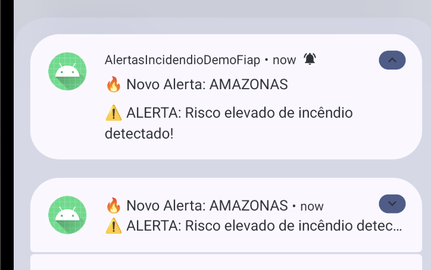
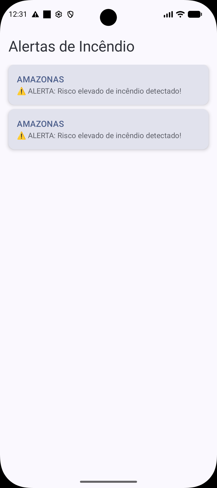

# 2.4 - Aplicativo Movel Android

## 2.4.1 - Introdução

Criamos um aplicativo movel Android que consulta a API do serviço de predição e exibe eventuais alertas detecatados. 

## 2.4.2 - Insstalação e execução do códgio

o projeto inteiro esta na pasta "src", e pode ser importada pelo Android Studio, assim é possível executar a aplicação no Emulador da IDE que permite acesso aos serviços que estiverem em execução dentro do seu computador. 

## 2.4.3 - Capacidades

A aplicação possui 2 capacidades principais:
1) Receber notificações via PUSH
- Esta função permite ao usuário ser notificado sem precisar estar com a aplicação aberta

 

2) Ver a lista dos alertas em aberto
- Esta função permite o usuário avaliar os alertas ainda em aberto
 

- Permite também visualizar os detalhes dos alertas (como valores da temperatura e umidade, além das recomendações de ações a serem tomadas)
 

